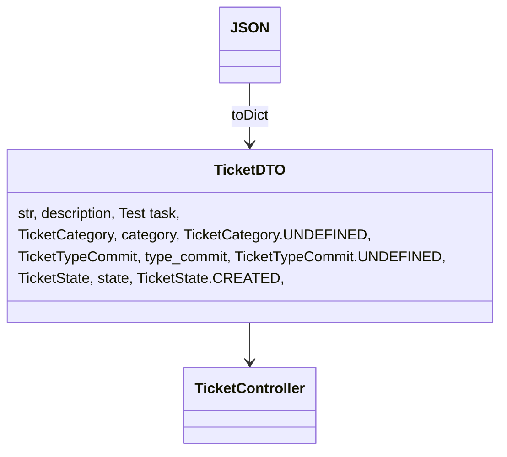

```mermaid
classDiagram
JSON --> TicketDTO :toDict
TicketDTO --> TicketController
class TicketDTO{
    str, description, Test task,
    TicketCategory, category, TicketCategory.UNDEFINED,
    TicketTypeCommit, type_commit, TicketTypeCommit.UNDEFINED,
    TicketState, state, TicketState.CREATED,
}
```